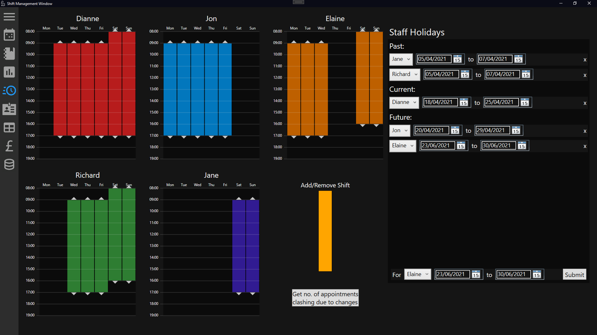
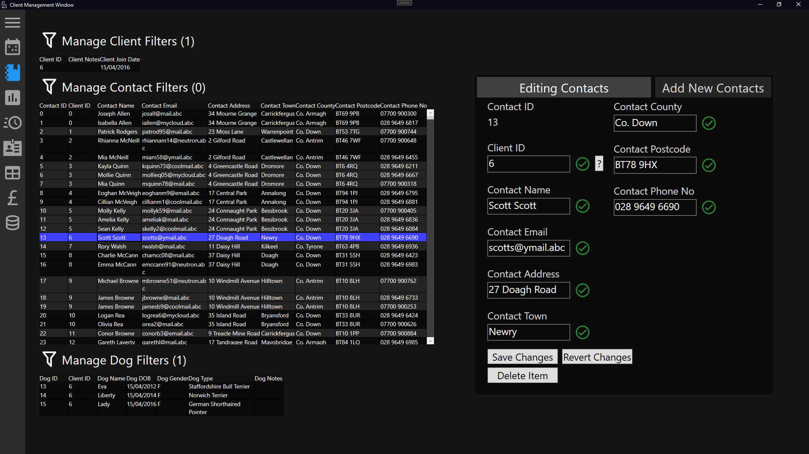

# A2-Project
This application was my A2 coursework project for Software Systems Development, written between 10/11/2020 and 14/03/2021 using C# and WPF.

The goal of this was to create a piece of software for JD Dog Care, a fictional dog grooming service. The case study is available at: https://www.rewardinglearning.org.uk/common/includes/microsite_doc_link.aspx?docid=28714-1

### Features

This software provides options for creating and managing dog grooming appointments, adding or managing dogs/contacts, managing staff schedules & holidays.

It also includes several other features like securely storing user passwords (all paswords are hashed, salted & peppered), a detailed statistics window, and a way to generate large amounts of test data.

Also semi-completed is the ability to generate then email or print customer invoices. This aspect was never fully finished, as we were informed this aspect of the application would not be marked as part of the A-Level.

### Other

Attached is my 40 page report on the project. The writeup is shorter than it would normally be, as it was cut short with time contstraints due to Covid-19. It has also had some information redacted to allow me to display it on GitHub. 

Some icons from https://iconify.design/icon-sets/mdi/

### Images

Below are some images of the project. More information is available in the 40 page report.

